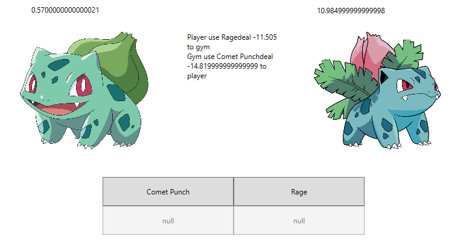

# IERG3080_part2
## Pokemon

### Acknowledgement
All graphics are searched from the internet. This is just for educational purpose, will not be used for publication.

### Overview

 

#### Encapsulation
Every class is designed to work independently and avoid other class to modify the code. In most case, private field is used if the methods or properties are not supposed to be called by other class. 

Only necessary informations or methods can be called in other class. E.g. Addpokemon() in player class and Isend() in Capture class.

Using public and private field dynamically can ensure the class can still interact with others while providing encapsulation features.

#### Class reuse
The resuse case mainly in the core part. Some frequently used methods are provided in the core class so that it doesn't need to code everytime from scratch in other classes. E.g. Addpokemon(), Delpokemon().

Pokemon class can be reuse as the LIST in player class to store the owned pokemon. Also as a individual like in capture class.

### Model View Presenter
Every class follows the MVP rules to separate between the logic, view. View responsible for the graphic, the presenter is involved in updating the graphic and the user input, keyboard WASD, and mouse click. Model responsible for the logic of the gameplay, Processing the data. Each level passes the data to other components as in the following picture.

 
For updating the view, we try to use some displayxxx method in class for the display update to separate the display from the logic of the backend. Also, each event handler has its method, e.g. USER DOWN , PokemonBagButton_Click, and SUBMIT_CLICK to separate the presenter from others. 

### Component

### Major Model

#### Pokemon Class

In a real-world situation, the pokemon list may modify constantly. We decide to create pokemon.xml to make it easily updated and modify. Our pokemon class read pokemon.xml to acquire data.  Below is an example in pokemon.xml.

	<Pokemon Id="1" Name="Bulbasaur" Hp="10" Attack="5" EvolveLv="25" Evolve="Ivysaur" Lv= "5" Cp="77" Type="grass" Height="2.04" Weight="15.2" Skill1="Comet Punch" Skill2="Rage" Skill3="null" Skill4="null" Price="100"></Pokemon>
	<Pokemon Id="2" Name="Ivysaur" Hp="15" Attack="7" EvolveLv="-1" Evolve="null" Lv= "10" Cp="107" Type="grass" Height="3.03" Weight="28.7" Skill1="Comet Punch" Skill2="null" Skill3="null" Skill4="null" Price="150"></Pokemon>
 
Pokemon class create properties for each above attribute to let our developer easy to implement. For the pokemon evolution, when the pokemon achieve EvolveLv, the pokemon can evolve(Evolve!="null"). The evolution form is the next id of the pokemon.

#### Player Class

For the player class, player class records the player information such as player's pokemon, money, and so on. It uses void AddPokemon to add the pokemon object to the MyPokemon List. Also, the singleton pattern ensures that the entire system only instantiates one object.

#### Capture

 

For capture, a mini-game of a random number guessing from 1-5 is introduced.
A random pokemon will encounter. The player needs to enter his guess. Correct guessing will add this pokemon to the player class with singleton pattern.

Model: Randomly choose 2 integers, one is pokemon ID, one is the guess number. And checking the input number from the presenter whether it is the same as the guess number or not. If it is the same, add the pokemon to player class and add some misc. e.g. money, stardust, and candy for LV up or evolving.

View: Displaying the image when initializing the corresponding ID from a model. Providing a textbox and button to visually promote the player to enter a number.

Presenter: Controlling the event handler of clicking and pass the input number from textbox to model. Also, update the promote message of correct guess or wrong guess back to view.

Design pattern:

Observer: Event handler of the submit click. When the click event is triggered, the answer in textbox will be read.

Wrapper: Some methods are wrapped into one larger method for some common combo of calling. Also, ensure the small parts can still be modularized. 

Adaptor: Allow to interact with the Navigation class that displaying the encounter pokemon on the map. Call capture class with the pokemon ID so that it is consistent with the map.

Encapsulation is adopted to prevent unwanted change from outside.

#### Gym Battle

Read all pokemon from player class for battle with some predefined GYM.

Model: Load all pokemon from player class and battle one by one until all has HP<=0. Read the chosen skill from the presenter and calculate the damage based on the skill attack. Then random choose a skill for GYM to attack the player. Repeat until one faints then the next pokemon in the list will be loaded. Repeat until no pokemon are left and decide who is the winner.

View: Display the current pokemon of the player and GYM. Show HP, the history of the fight and also the available skills for the player.

Presenter: Updating the current pokemon if the new pokemon is loaded. Update HP every turns. Update the available skills if new pokemon is loaded. Click event handler will return the skill name to the model to process the fight.

Design pattern:

Observer: For skill click event from the user. 

Composite: The skills button as a button group, bound together. 

Wrapper: Some methods are wrapped into one larger method for some common combo of calling. Also, ensure the small parts can still be modularized. 

#### Extra feature:
 

New extra mode for capture class. Adding a mechanism of accumulating of the luck. Every time the player fails to catch a pokemon, luck is accumulated. If luck is >=100, then the player must catch the pokemon.

This is demonstrating the use of static type in class. It can be served as the global parameter.

Model: A static parameter in capture class. To add and verify if the luck parameter is reached >=100 and add the pokemon to player class.

View: Extra textblock is added under the capture windows to show the luck.

Presenter: Update the textblock when initializing capture windows to view.

#### Navigation

Using W(up) S(down) A(Left) D(Right) to control character moving. Player encounter pokemon will show capture window. Player enter gymbattle will show gymbattle window. Also, Click on pokemonball button will navigate to pokemon bag page.

Model: Get the pokemon image form pokemon class and the coordinate from player class.

View: The view is base on the map is controlled by canvas. The randomized pokemon will be displayed in different locations by the presenter initialize everytime. 

Presenter: The presenter controls the movement of the character when the player press W(up) S(down) A(Left) D(Right). When player does any action such as gymbattle or capture, the page will refresh that 10 pokemon will randomize in different locations and randomly move around the map.

#### Poekmon Bag

Click on pokemonball button, pokemonBag page will display all player's pokemon. Clicking the corresponding pokemon will navigate to pokemonBag_pokemon page which displays the data of the pokemon. Player can do PoweUp, evolution, sell, rename process with that pokemon.

Model: Get all player information from player class including MyPokemon, money, stardust, and so on.

View: After click corresponding pokemon, the pokemon information will be displayed. The presenter will update the view.

Presenter: Player can click on the button to do PoweUp, evolution, sell , rename process. It will update Player class data and update the UI immediately.

### Challenges overcome

