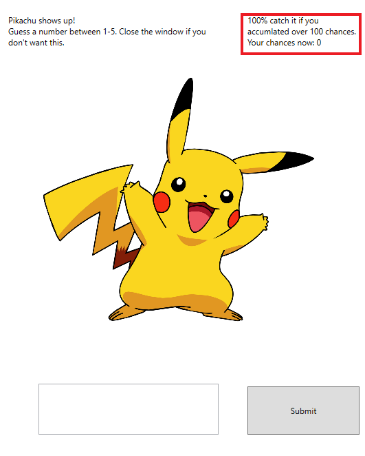

# IERG3080_part2
## Pokemon

### Overview

### Model View Presenter
Every class follows the MVP rules to seperate between the logic, view. View responsible for the graphic, presenter is involved in updating the graphic and the user input, keyboard WASD and mouse click. Model responsible for the logic of the gameplay, Processing the data. Each level pass the data to other components as in the following picture.

 
For updating the view, we try to use some displayxxx method in class for the display update to seperate the display from the logic of the backend. Also each event handler has its own method, e.g. USER DOWN , PokemonBagButton_Click and SUBMIT_CLICK to seperate the presenter from others. 

#### Capture

 

For capture, a mini-game of random number guessing from 1-5 is introduced.
A random pokemon will encounter. Player needs to enter his guess. Correct guessing will add this pokemon to the player pokemon bag.

Model: Randomly choose 2 integers, one is pokemon ID, one is the guess number. And checking the input number from presenter whether it is the same as the guess number of not. If it is the same, add the pokemon to pokebag and add some misc. e.g. money, stardust and candy for LV up or evolving.

View: Displaying the image when initialize of the corresponding ID from model. Providing a textbox and button to visually promote the player to enter a number.

Presenter: Controlling the event handler of clicking and pass the input number from textbox to model. Also update the promote message of correct guess or wrong guess back to view.

Design pattern:

Observer: Event handler of the submit click. When the click event is triggered, the answer in textbox will be read.

Wrapper: Some methods are wrapped into one larger method for some common combo of calling. Also ensure the small parts can still be modularized. 

Encapsulation is adopted to prevent the unwanted change from outside.

#### Gym Battle

Read all pokemon from pokebag for battle with some predefined GYM.

Model: Load all pokemon from pokebag and battle one by one until all has HP<=0. Read the chosen skill from presenter and calculate the damage based on the skill attack. Then random choose a skill for GYM to attack player. Repeat until one is fainted then next pokemon in the list will be loaded. Repeat until no pokemon are left and decide who is the winner.

View: Display the current pokemon of the player and GYM. Show HP, the history of the fight and also the available skills for player.

Presenter: Updating the current pokemon if new pokemon is loaded. Update HP every turns. Update the available skills if new pokemon is loaded. Click event handler will return the skill name back to the model to process the fight.

Design pattern:

Observer: For skill click event from user. 

Composite: The skills button as button group, bound together. 

Wrapper: Some methods are wrapped into one larger method for some common combo of calling. Also ensure the small parts can still be modularized. 

#### Extra feature:
 

New extra mode for capture class. Adding a mechanism of accumulating of the luck. Every time the player fails to catch a pokemon, luck is accumulated. If luck is >=100, then player must catch the pokemon.

This is demonstrating the use of static type in class. It can be served as the global parameter.

Model: A static parameter in capture class. To add and verify if the luck parameter is reached >=100 and add the pokemon to pokebag.

View: Extra textblock is added under the capture windows to show the luck.

Presenter: Update the textblock when initializing capture windows to view.
